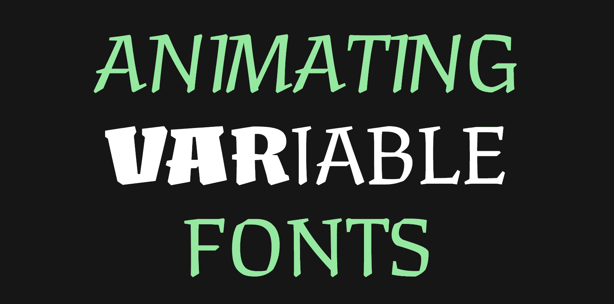

# Animating Variable Fonts

- Letterform Archive (Type West) Public Workshop Summer 2021
- 5:00–8:00pm PDT, 2 Wednesdays + 2 Thursdays in August
- Instructors: [Lynne Yun](https://lynneyun.com), [Kevin Yeh](http://kevbk.com)
- TAs: [Hugo Baeta](http://hugobaeta.com/), [Tommi Sharp](https://tommisharp.com/)
- Course Discussion: Slack

## Course Description

Variable fonts have been a topic of growing curiosity in the type world — but how do we use them on the web? Have you ever thought about building your own variable type tester, or wondered how they could be brought to life through code?

Over four evenings (August 18, 19, 25 & 26), this beginner-friendly course will cover the fundamentals of programming using both HTML+CSS web basics and P5.js, a beginner-friendly Javascript framework. We’ll explore how to utilize these tools with variable fonts to create interesting digital experiences, opening new doors and finding fresh avenues for experimentation … and fun!

Techniques covered in this course will include introductory HTML, CSS, and Javascript concepts, and how they can be applied to time and interaction-based CSS manipulation and animation on the web using variable font features.
youtu.be/xJcrPJuem5Q)

## Topic Sections

## Section 0: Before the First Week
- Make an account for the [P5.js Web Editor](https://editor.p5js.org/)
- Join the Generative Type Slack 

## Section 1: Intros and HTML/CSS

- 👋 Intros & Housekeeping
- "Intro to Variable Fonts & the Design Space" Lecture
- Variable Fonts on the web using HTML and CSS

### Variable Font Examples
- [SFSymphony Brand Design](https://www.wearecollins.com/work/sf-symphony/) by COLLINS
- [GT Maru Typeface](https://www.gt-maru.com/)
- [Variable Font Rendering in 3D](https://twitter.com/kmkota0/status/1160929260271525888)
- [Interview with Bianca Berning](https://www.itsnicethat.com/news/dalton-maag-variable-fonts-opinion-graphic-design-100220)

### References from class demos:
* Fixed/Fluid design with max-width: [demo sketch](https://editor.p5js.org/kyeah/sketches/my9dD-g98)
* setting font-size with breakpoints: [demo sketch](https://editor.p5js.org/kyeah/sketches/iEqWTe_7e)
* flex-grid: [demo sketch](https://editor.p5js.org/kyeah/sketches/C4pUtm9DF)
* fluid styling with calc : [demo sketch](https://editor.p5js.org/kyeah/sketches/PDgYSpenf)
* Using a custom font (@font-face): [demo sketch](https://editor.p5js.org/kyeah/sketches/lAbR2rh_V)

### (free) resources for learning HTML and CSS:
* [http://www.dontfeartheinternet.com](http://www.dontfeartheinternet.com/)
* [https://internetingishard.com](http://www.dontfeartheinternet.com/)

## Section 2: HTML/CSS Part 2 & Intro to javaScript

### Inspecting Variable Fonts:
- https://wakamaifondue.com/
- https://www.axis-praxis.org/samsa/
- Firefox Font Inspector

### Finding (free) variable fonts:
- https://fontsarena.com/tag/variable-font/
- https://v-fonts.com/
- https://fonts.google.com/variablefonts
- https://www.axis-praxis.org
- https://www.fontshare.com/

### References:
* [CSS Animations](https://developer.mozilla.org/en-US/docs/Web/CSS/CSS_Animations/Using_CSS_animations)
* [Flexbox](https://css-tricks.com/snippets/css/a-guide-to-flexbox/)
* [Using Google Variable Fonts](https://css-tricks.com/getting-the-most-out-of-variable-fonts-on-google-fonts/)
* [Focus/Active/Hover CSS](https://bitsofco.de/when-do-the-hover-focus-and-active-pseudo-classes-apply/)
* [Learn p5.js](https://p5js.org/learn/)

### Demo Sketch Collection

* [Part 1](https://editor.p5js.org/kyeah/sketches/5pDxUr4Q-)
* [Part 2 (inhale/exhale)](https://editor.p5js.org/kyeah/sketches/wDL2Dew9l)
* [Part 2.5 (hover to reveal)](https://editor.p5js.org/kyeah/sketches/1QyDvw5dq)
* [Part 3 (individual letter animations)](https://editor.p5js.org/kyeah/sketches/5DhcXolZa)

### Suggested Resources for Learning

**Coding Train:**

* [Errors and Console (Coding Train)](https://www.youtube.com/watch?v=LuGsp5KeJMM)
* [Code Comments (Coding Train)](https://www.youtube.com/watch?v=xJcrPJuem5Q)
* [Variables in p5.js (Coding Train)](https://www.youtube.com/watch?v=RnS0YNuLfQQ&list=PLRqwX-V7Uu6Zy51Q-x9tMWIv9cueOFTFA)
* [Variables pt 2 (Coding Train)](https://www.youtube.com/watch?v=Bn_B3T_Vbxs)
* [While / For Loops (Advanced, Coding Train)](https://www.youtube.com/watch?v=cnRD9o6odjk&list=PLRqwX-V7Uu6Zy51Q-x9tMWIv9cueOFTFA&index=19)

**Allison Parrish:**

* [First Steps in p5.js (Allison Parrish)](https://creative-coding.decontextualize.com/first-steps/)
* [Expressions, Variables, Loops (Allison Parrish)](https://creative-coding.decontextualize.com/expressions-variables-and-loops/)

## Section 3: JavaScript and Variable Fonts

### Further resources for Glyphs

* [Glyphs App Website](https://glyphsapp.com/)
* [Variable Fonts Tutorial](https://glyphsapp.com/learn/creating-a-variable-font)

### Demo Sketch Collection:

* [Ball movement exercise 1](https://editor.p5js.org/kyeah/sketches/8jXTfynCV)
* [Ball movement exercise 2 (bouncing)](https://editor.p5js.org/kyeah/sketches/u568k3-SX)
* [Updating wght with JS](https://editor.p5js.org/kyeah/sketches/hA82_0UBQ)
* [Updating wght with slider](https://editor.p5js.org/kyeah/sketches/2QJfOIY_e)
* [Updating multiple elements with for loop](https://editor.p5js.org/kyeah/sketches/wGRC3TC3E)

### Suggested Video Tutorial

* [Coding Train: While / For loops](https://www.youtube.com/watch?v=cnRD9o6odjk)

## Section 4: JavaScript and Variable Fonts Part 2

### Demo Sketch Collection

* [mouse location variables, map() and sound](https://editor.p5js.org/lynneyun/sketches/whakhK1U-)
* [variable weights using mouseX & windowWidth](https://editor.p5js.org/kyeah/sketches/LvfUN4HRR)
* [variable weights using sound](https://editor.p5js.org/kyeah/sketches/XHoZu2MFQ)
* [time-based sine animation](https://editor.p5js.org/kyeah/sketches/rsOlvKq6L)
* [splitting characters + time offsets](https://editor.p5js.org/kyeah/sketches/-qqnHz7_L)

### Advanced Examples Shown

- [Reacting to Mic Sound - FFT](https://editor.p5js.org/kyeah/sketches/il95px5wt)

#### Responsive Text on the Web
 
- [Responsive I (textbox size)](https://editor.p5js.org/kyeah/sketches/K4zOwPxvu)
  - [Using native Javascript (no p5.js)](https://editor.p5js.org/kyeah/sketches/zJz_BDHyW)
- [Responsive II (window size)](https://editor.p5js.org/kyeah/sketches/RvQoj8Dmn)
  - [Using native Javascript (no p5.js)](https://editor.p5js.org/kyeah/sketches/MYP3U6LU1)
- [Responsive III (resizable div)](https://editor.p5js.org/kyeah/sketches/zy9C-DrFG)
- [Responsive IV (scrolling)](https://editor.p5js.org/kyeah/sketches/1jj1iu3RF)
  - For more complex behavior see: [ScrollTrigger](https://greensock.com/scrolltrigger/)
